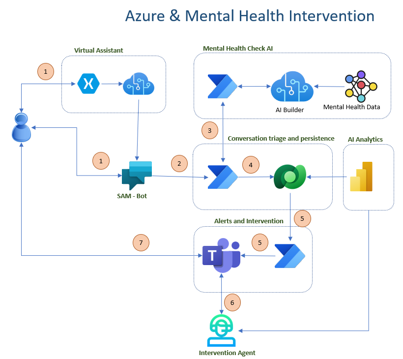

# SAM - A Mental Health Check Bot
An AI based mental health state of mind detection and possible intervention using Power Platform and Teams

# Disclaimer
The dataset used in this solution was obtained from open source dataset repositories like [Kaggle](https://www.kaggle.com/) and cleaned. It is **NOT** to be taken as an authoritative source for detecting mental health issues.But more of a proof of concept on how to leverage such datasets.

# Reference Architecture

# Pre-Requisites

1. Power Platform license
2. Power Virtual Agent License
3. Power BI License
4. AI Builder License
5. Access To Teams
6. Azure Storage Account to store the image of SAM

# Solution
The folder `Power App Solution` has the complete solution (except the Teams and Power BI report components).

# Clone & Import 
1. Clone this repository to your local computer
2. Go to the folder `Power Apps Solution`
3. [Import Zip file into Power Apps](https://docs.microsoft.com/en-us/power-apps/maker/data-platform/import-update-export-solutions)

## Few things to update
1. There are connections references that needs to be created and/or approved when importing the solution
2. Open the `GetTeamsNotified` Flow and update the url for storage account that has the SAM image. 
3. Open the `GetTeamsNotified` Flow and update the email address of the Teams recipient who would receive the Teams notifications. 

# Publish and Run the Power Virtual Agent
1. [Publish your bot to a website](https://docs.microsoft.com/en-us/power-virtual-agents/publication-fundamentals-publish-channels)
2. Navigate to the web site and chat with the bot. 
3. If you enter text that are in suicidal in nature, the bot would respond empathetically and a notification is sent to a Teams user.
 

